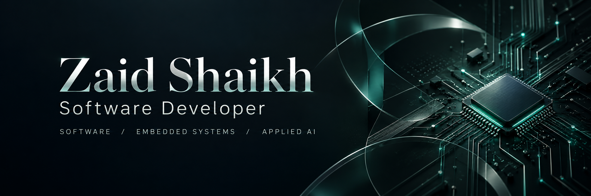

  

  <strong>Building practical applications and connected systems.</strong> 
  Python &amp; Django · Embedded Systems &amp; IoT · AI &amp; Computer Vision

  
  
  
  

---

## About

I'm **Zaid Shaikh**, a developer based in **Mumbai, India**. I’m pursuing a B.Tech in Electronics & Telecommunication Engineering, with a minor in Computer Engineering, at **Sardar Patel Institute of Technology**.

I build backend applications with Python and Django, develop firmware for embedded devices, and connect hardware to software through sensors and MQTT. I also explore machine learning and computer vision through practical projects.

My approach is hands-on: understand the workflow, build a working system, and document it so others can use and extend it.

**Current focus:** Django REST Framework, healthcare applications of AI, and ESP32-based connected systems.

 

## Selected projects

### ParkWise · Parking Management System

A Django application for parking area discovery, slot reservations, booking tokens, and administration. MQTT and ESP32 integration connect the booking workflow to parking gate verification.

**Built with:** Python, Django, MySQL, JavaScript, MQTT, ESP32.

[Explore repository →](https://github.com/ZaidShaikh-2005/parking-management-system)

### ASHA Care · Family & Member Management

A Django application for managing family records and their members through a healthcare workflow. Includes PIN-based access, a dashboard, and tools to add, search, view, and edit records, with a Windows installer for distribution.

**Built with:** Python, Django, HTML, CSS, JavaScript.

[Explore repository →](https://github.com/ZaidShaikh-2005/community-help) · [Community contribution →](https://github.com/orgs/community/discussions/208038#discussioncomment-18501894)

### MedIntel · Remote Healthcare & Patient Monitoring

A healthcare project combining patient records, sensor measurements, historical data, and alerts. Explores machine learning and AI-assisted analysis alongside a Django REST Framework backend.

**Focus:** Python, Django REST Framework, IoT, machine learning.

[View my project portfolio →](https://zaidshaikh-2005.github.io/Portfolio/projects.html)

### LiFiLink · Optical Wireless Communication

An embedded communication project exploring visible-light data transmission using ESP32 modules, LED transmission, a solar-panel receiver, and on-off keying modulation.

**Focus:** C++, ESP32, embedded firmware, circuit design.

[View my project portfolio →](https://zaidshaikh-2005.github.io/Portfolio/projects.html)

## Technologies

| Area | Technologies |
| :--- | :--- |
| Programming | Python, C, C++, JavaScript, Java |
| Backend & web | Django, Django REST Framework, Flask, HTML, CSS |
| Data | SQL, MySQL, SQLite, MongoDB, Firebase |
| Embedded & IoT | ESP32, STM32, ARM, Raspberry Pi, MQTT, sensors, firmware |
| AI & analysis | Machine learning, computer vision, Ollama, Power BI |
| Development tools | Git, Docker, Arduino IDE, Proteus |

## Learning & community

I share practical development solutions and learn through project work, technical discussions, and experimentation.

[GitHub Community answer](https://github.com/orgs/community/discussions/208038#discussioncomment-18501894) · [Kaggle](https://www.kaggle.com/zzaidshaikh) · [LeetCode](https://leetcode.com/u/zaid_shaikh13105/)

<strong>An interactive side project</strong>

My portfolio includes **Contribution Blaster**, a browser game inspired by the GitHub contribution grid.

[Play Contribution Blaster →](https://zaidshaikh-2005.github.io/Portfolio/bubble-shooter.html) · [Explore portfolio source →](https://github.com/ZaidShaikh-2005/Portfolio)

Move to aim, hold the left mouse button to fire, and press **R** to restart.

---

  <strong>Let’s build something useful.</strong> 
  Open to conversations about software development, embedded systems, IoT, and applied AI.  
  <a href="https://zaidshaikh-2005.github.io/Portfolio/contact.html">Get in touch</a> ·
  <a href="https://www.linkedin.com/in/zaid-shaikh-2oo5/">LinkedIn</a> ·
  <a href="https://zaidshaikh-2005.github.io/Portfolio/">Portfolio</a>

